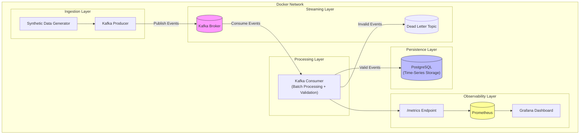

```mermaid
    flowchart TB

        subgraph Docker_Network["Docker Network"]
            
            subgraph Ingestion_Layer["Ingestion Layer"]
                A["Synthetic Data Generator"]
                B["Kafka Producer"]
            end

            subgraph Streaming_Layer["Streaming Layer"]
                C[("Kafka Broker")]
                DLQ[("Dead Letter Topic")]
            end

            subgraph Processing_Layer["Processing Layer"]
                D["Kafka Consumer\n(Batch Processing + Validation)"]
            end

            subgraph Storage_Layer["Persistence Layer"]
                E[("PostgreSQL\n(Time-Series Storage)")]
            end

            subgraph Observability_Layer["Observability Layer"]
                M["/metrics Endpoint"]
                P[("Prometheus")]
                G["Grafana Dashboard"]
            end
        end

        %% Data Flow
        A --> B
        B -->|Publish Events| C
        C -->|Consume Events| D

        D -->|Valid Events| E
        D -->|Invalid Events| DLQ

        %% Metrics Flow
        D --> M
        M --> P
        P --> G

        %% Styling
        style C fill:#f9f,stroke:#333,stroke-width:1px
        style E fill:#bbf,stroke:#333,stroke-width:1px
        style P fill:#ff9,stroke:#333,stroke-width:1px

```