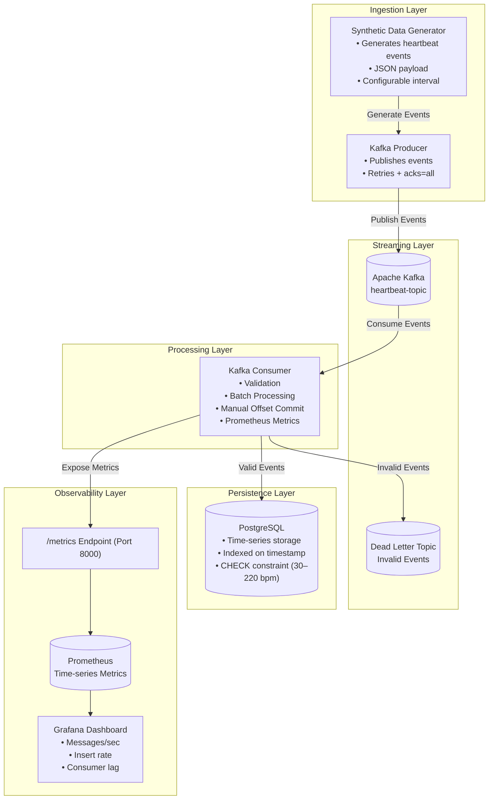

# Real-Time Customer Heartbeat Monitoring System Set Up Guide

### Prerequisites

Ensure the following are installed:

- Docker

- Docker Compose

- Git

- (Optional) Python 3.11 for local development


### Clone Repository
``` bash
    git clone https://github.com/GhGuda Kafka-real-time-heartbeat-monitoring-Amalitech
    cd Kafka-Real-Time-Heartbeat-Monitoring
```

### Start the System
Build and run all services:
```bash
    docker-compose up --build
```

This will start:
- Zookeeper

- Kafka

- PostgreSQL

- Producer

- Consumer

- Prometheus

- Grafana


### Access Services

Kafka UI (if configured)
```bash
    http://localhost:8080
```

Prometheus

```bash
    http://localhost:9090
```

Grafana
``` bash
    http://localhost:3000
```
- Login:
```bash
    admin /admin
```

### Viewing Metrics

In Grafana:

1. Add Prometheus as data source:
    ``` bash
        http://prometheus:9090
    ```
2. Create dashboard panels:
    - rate(heartbeat_messages_received_total[1m])
    - rate(heartbeat_messages_inserted_total[1m])
    - heartbeat_consumer_lag


### Database Access
Connect to PostgreSQL via:

    - pgAdmin
    - Or:
        docker exec -it <postgres_container> psql -U <user> -d <db>


### Stop the System
``` bash 
    docker-compose down
```

To remove volumes (reset database):
``` bash
    docker-compose down -v
```
---


# Architecture Diagram 
